# Constellation MCP Server

[](https://www.npmjs.com/package/@constellationdev/mcp)   [](LICENSE) [](https://snyk.io/test/github/ShiftinBits/constellation-mcp)

Give your AI coding assistant instant, intelligent access to your entire codebase's structure, dependencies, and relationships without transmitting any source code. Constellation provides code intelligence as a service to AI coding assistant tools.

## Quick Start

[](vscode:mcp/install?%7B%22name%22%3A%22constellation%22%2C%22type%22%3A%22stdio%22%2C%22command%22%3A%22npx%22%2C%22args%22%3A%5B%22-y%22%2C%22%40constellationdev%2Fmcp%40latest%22%5D%2C%22tools%22%3A%5B%22code_intel%22%5D%2C%22env%22%3A%7B%22CONSTELLATION_ACCESS_KEY%22%3A%22CONSTELLATION_ACCESS_KEY%22%7D%7D) [](https://cursor.com/en-US/install-mcp?name=constellation&config=eyJ0eXBlIjoic3RkaW8iLCJjb21tYW5kIjoibnB4IC15IEBjb25zdGVsbGF0aW9uZGV2L21jcEBsYXRlc3QifQ%3D%3D)

Add the Constellation MCP server to your AI assistant project-level config (or system-level if your tooling doesn't support project-level configuration):

```json
{
  "mcpServers": {
    "constellation": {
      "type": "stdio",
      "command": "npx",
      "args": ["-y", "@constellationdev/mcp@latest"]
    }
  }
}
```

> [!NOTE]  
> The above example is a generic format for the `.mcp.json` file used by some tools such as VSCode and Claude Code.
>
> For information on configuring other AI assistants see the [MCP Server > Installation doc](https://docs.constellationdev.io/mcp/#installation).

For further instructions regarding authentication, project setup, and configuration refer to the [official docs](https://docs.constellationdev.io/).

## How It Works

```mermaid
%%{init: {'theme': 'dark', 'themeVariables': { 'primaryColor': '#4A90E2', 'primaryTextColor': '#EEEEEE', 'primaryBorderColor': '#2B2C34', 'lineColor': '#4A90E2', 'secondaryColor': '#1F1F28', 'tertiaryColor': '#0B0C10', 'edgeLabelBackground': '#1F1F28' }}}%%
flowchart LR
    subgraph local["💻 Your Environment"]
        direction TB
        code["📂 Source Code"]
        cli["⚙️ Constellation CLI"]
        ai["🤖 AI Coding Assistant"]
        mcp["🧩 Constellation MCP"]
        code --> cli
    end

    subgraph cloud["✨ Constellation Service"]
        direction TB
        api["🔌  API"]
        graphdb[("🧠 Knowledge Graph")]
        api <--> graphdb
    end

    cli a1@-->|"Metadata Upload"| api
    ai <-->|"Tool Calls"| mcp
    mcp a2@<-->|"Queries"| api

    a1@{ animation: fast }
    a2@{ animation: fast }

    style local fill:#1F1F28
    style cloud fill:#1F1F28,stroke:#4A90E2
    style cli stroke:#4A90E2
    style mcp stroke:#4A90E2
    style api stroke:#4A90E2
    style graphdb stroke:#4A90E2
```



1. **Parse and Analyze**: The CLI tool analyzes source code in **_your_** environment, extracting structural metadata (functions, classes, variables, imports, calls, references, etc.)
2. **Upload**: Only the metadata is securely sent to Constellation, never raw source code
3. **Query**: AI assistants use the Constellation MCP tool to send complex queries, and get rapid answers derived from the knowledge graph

## Documentation

Find the full and comprehensive documentation at **[docs.constellationdev.io/mcp/](https://docs.constellationdev.io/mcp/)**

- [Installation & Setup](https://docs.constellationdev.io/mcp/#installation) - Configure for Claude Code, Cursor, GitHub Copilot, and more
- [Tools Reference](https://docs.constellationdev.io/mcp/tools) - Code Mode API and available methods
- [Troubleshooting](https://docs.constellationdev.io/mcp/troubleshooting) - Common issues and solutions

## Privacy & Security

- **No source code transmission** - Only metadata and relationships
- **Access control** - API keys required for all requests
- **Branch isolation** - Each git branch maintains discrete code intelligence

For comprehensive information regarding privacy and security, see the [official Privacy & Security documentation](https://docs.constellationdev.io/privacy).

## Support

- Documentation: [docs.constellationdev.io](https://docs.constellationdev.io)
- Report Issues: [GitHub Issues](https://github.com/shiftinbits/constellation-mcp/issues)

## License

AGPL-3.0 - See [LICENSE](LICENSE) for details.

Copyright © 2026 ShiftinBits Inc.
